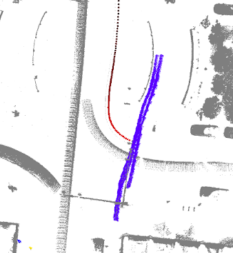
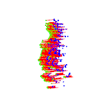
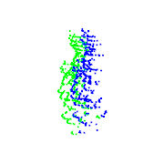
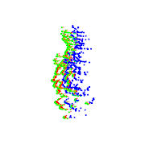
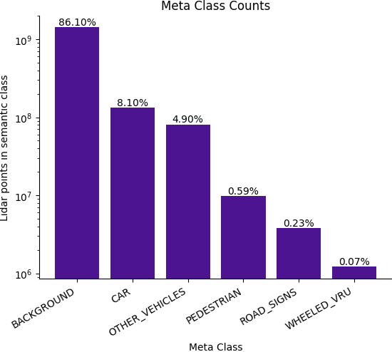
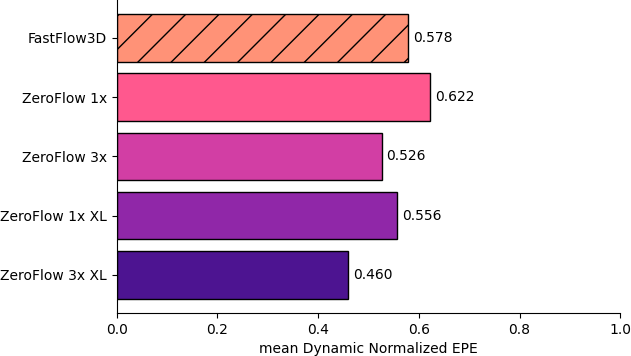

HEADER AV2 2024 Scene Flow Challenge Announcement

# AV2 2024 Scene Flow Challenge Announcement

## TL;DR

The AV2 2024 Scene Flow Challenge is focused on the long tail of scene flow. As part of this year’s challenge, we are announcing a new scene flow evaluation protocol.

## Pedestrians matter in scene flow

Scene flow estimation is the task of describing the 3D motion field between temporally successive point clouds. High quality scene flow methods should be able to describe the 3D motion of any object because they have an understanding of geometry and motion.

To ensure scene flow estimators live up to this promise, they must be evaluated across a diversity of objects — it’s just as important to be able to describe the motion of pedestrians, bicyclists, and motorcyclists as it is to describe the motion of cars, trucks, and buses. However, current state-of-the-art scene flow estimators are very far from robustly describing the motion of small but important objects.

## Current methods fail on non-car objects

As a qualitative example, consider [Argoverse 2's val sequence _0bae3b5e-417d-3b03-abaa-806b433233b8_](./av_vis/av2/val_75.html#0bae3b5e-417d-3b03-abaa-806b433233b8). The ego vehicle attempts to turn left at an intersection, but pauses to let two pedestrians cross the street. We select this sequence because the two pedestrians are moving close to the ego vehicle, providing unusually high density lidar observations and thus ample point structure for scene flow methods to detect motion. Somewhat surprisingly, current methods fail to estimate scene flow for non-car (e.g. pedestrian) objects.

_Figure 1._ Accumulated point cloud of AV2’s val 0bae3b5e-417d-3b03-abaa-806b433233b8 sequence. The ego vehicle is preparing to make a left turn (shown in increasing red over time) and slows to allow two pedestrians (shown in blue) to cross the street. 

<table>
    <tr>
        <th>GT</th>
        <th>NSFP</th>
        <th>ZeroFlow</th>
        <th>FastFlow3D</th>
    </tr>
    <tr>
        <td></td>
        <td></td>
        <td></td>
        <td></td>
    </tr>
</table>

_Figure 2._ We visualize a cherry picked example of a pedestrian with unusually high density lidar returns. We expect that state-of-the-art scene flow methods should work particularly well on this instance, but find that all methods consistently fail. 

 - **GT:** Side view of the pedestrians crossing the street. The ground truth flow vectors, shown in red, depict the flow of the green points at time t to their positions at t+1 relative to the blue t+1 point cloud.
- **Neural Scene Flow Prior (NSFP)** does not estimate any flow for the pedestrians. NSFP is a popular test-time optimization method for scene flow due to its simplicity and good Average EPE performance. Many recent methods use NSFP as their workhorse flow estimator (Chodosh et al. [@Chodosh_2024_WACV], NSFP++ [@Najibi_2022_ECCV], Vacek et al. [@Vacek_2023_arXiv]). 
 - **ZeroFlow** [@vedder2024zeroflow], which uses NSFP pseudo-labels to train a student feed forward network that produces superior quality flow to its NSFP teacher, also does not capture any of the pedestrian motion between these two frames. 
 - **FastFlow3D**, a fully-supervised scene flow method, similarly fails to capture meaningful motion.

Figure 2 qualitatively demonstrates the systematic failures on small objects seen across various state-of-the-art scene flow methods. These failures are present in all types of scene flow methods (e.g. supervised, self-supervised, optimization-based).

## Current metrics are biased towards objects with many points

The most common Scene Flow evaluation metric is Average Endpoint Error (Average EPE), i.e. the average over the L2 distance between the endpoint of the estimated vs ground truth flow vector for each point. Because this evaluation is computed on a per-point basis, not a per-object basis (pedestrian instances are fairly common, but only comprise a tiny fraction of the total points), Average EPE is dominated by background points. On real-world AV datasets, over 80% of lidar points are from the background (Figure 4).

Chodosh et al. [@Chodosh_2024_WACV] present Threeway EPE, an alternative evaluation metric which partially addresses the foreground / background imbalance. Specifically, average EPE is computed for three mutually exclusive buckets: Background Points, Foreground Static (points moving <0.5m/s), and Foreground Dynamic (points moving >0.5m/s). As described in their paper, this prevents background points from dominating the resulting metric; however, it is still biased towards objects with many points. Foreground Dynamic and Foreground Static are dominated by points from `CAR` and `OTHER_VEHICLES` (Figure 3), owing to their larger per-instance object size and thus larger number of point returns.

_Figure 3._ Plot of number of points from each semantic meta-class for AV2 val. Although `PEDESTRIAN` instances are common, they are a small fraction of the total number of points owing to their small size relative to `CAR` and `OTHER_VEHICLES`. Number of points (Y axis) shown on a log scale.  

## Our new metric: _Bucketed Scene Flow Eval_

Our evaluation metric, Bucketed Scene Flow Eval, addresses these issues by breaking down the point distribution across semantic class and speed in order to directly evaluate performance across the long-tail of points. Our metric is computed as follows:

First, we assign all points in each frame-pair to a bucket (defined by the class-speed matrix, e.g. Table 1). We then compute the average EPE and average ground truth speed per bucket. We compute Normalized EPE for each of the dynamic buckets (the second speed column onwards is considered dynamic) by dividing the average EPE by the average speed. 

<table class="data_table">
  <tr><th rowspan="2" style="text-align: center;">Class</th><th colspan="5" style="text-align: center;">Speed Columns</th></tr>
  <tr><td>0-0.4m/s</td><td>0.4-0.8m/s</td><td>0.8-1.2m/s</td><td>...</td><td>20-∞m/s</td></tr>
  <tr><td>`BACKGROUND`</td><td>-</td><td>-</td><td>-</td><td>-</td><td>-</td></tr>
  <tr><td>`CAR`</td><td>-</td><td>-</td><td>-</td><td>-</td><td>-</td></tr>
  <tr><td>`OTHER_VEHICLES`</td><td>-</td><td>-</td><td>-</td><td>-</td><td>-</td></tr>
  <tr><td>`PEDESTRIAN`</td><td>-</td><td>-</td><td>-</td><td>-</td><td>-</td></tr>
  <tr><td>`ROAD_SIGNS`</td><td>-</td><td>-</td><td>-</td><td>-</td><td>-</td></tr>
  <tr><td>`WHEELED_VRU`</td><td>-</td><td>-</td><td>-</td><td>-</td><td>-</td></tr>
</table>

_Table 1._ Example of the structure of the class-speed matrix for _Bucketed Scene Flow Eval_.  

Unlike existing metrics, Normalized EPE allows us to answer the question: what fraction of the total speed of the point was not described by the flow vectors in that bucket? A method that only predicts ego motion (or zero vectors if egomotion is compensated for) will have 1.0 Normalized EPE for all dynamic buckets, and a method that perfectly describes all motion will have 0.0 Normalized EPE for all moving buckets. Methods may achieve errors greater than 1.0 Normalized EPE by predicting errors with magnitude greater than the average speed; for example, a method that describes the negative vector of true motion will get exactly 2.0 Normalized EPE for all moving buckets with points (the bucket EPE will be exactly 2x the magnitude of the average speed). The range of Normalized EPE is between 0 (perfect) and ∞ (arbitrarily bad), and is undefined for buckets without any points.

We summarize the performance of each meta-class with two numbers:

1) We summarize performance on static objects with Average EPE of the static bucket (the first column). We do not use Normalized EPE, as dividing by very small or zero ground truth motion is noisy / undefined.
2) We summarize performance on dynamic objects with Normalized EPE of the dynamic buckets. (second speed column onwards).

We present the results of the ZeroFlow 3x model at 35m evaluated with our proposed metric in Table 2. 

<table class="data_table">
  <tr><th style="text-align: center;">Class</th><th style="text-align: center;">Static (Avg EPE)</th><th style="text-align: center;">Dynamic (Norm EPE)</th></tr>
  <tr><td>`BACKGROUND`</td><td>0.01</td><td>-</td></tr>
  <tr><td>`CAR`</td><td>0.01</td><td>0.22</td></tr>
  <tr><td>`OTHER_VEHICLES`</td><td>0.02</td><td>0.43</td></tr>
  <tr><td>`PEDESTRIAN`</td><td>0.01</td><td>0.91</td></tr>
  <tr><td>`ROAD_SIGNS`</td><td>0.01</td><td>0.48</td></tr>
  <tr><td>`WHEELED_VRU`</td><td>0.01</td><td>0.59</td></tr>
</table>

_Table 2._ Example _Bucketed Scene Flow Eval_ results for the _ZeroFlow 3x_ model from Vedder et al. [@vedder2024zeroflow], limited to a 35m box around the ego vehicle. `BACKGROUND` does not contain any moving points, so it has “–” recorded for its _Dynamic_ error. **Lower is better**.  

As we can see in Table 2, ZeroFlow 3x performs well on static points, and fairly well on `CAR` (capturing over 75% of motion) but it performs extremely poorly on `PEDESTRIAN` (capturing less than 10% of motion). Thus, _Bucketed Scene Flow Eval_ enables us to quantitatively measure the qualitative issues we discovered above.

To summarize overall method performance, we take a mean over the different meta-classes for each column, giving `ZeroFlow 3x` a mean Average Bucketed Error (mABE) of `(0.011, 0.526)`. In the context of our challenge, methods are ranked by their mean dynamic normalized EPE (i.e. second component of mABE).

_Figure 4._ Plot of _mean Dynamic Normalized EPE_ for various configurations of unsupervised ZeroFlow [@vedder2024zeroflow] and supervised FastFlow3D [@jund2021scalable]. Supervised methods shown with hatching. **Lower is better**.

Method relative performance ordering is preserved between traditional metrics like _Threeway EPE_ (e.g. ZeroFlow 3x XL vs ZeroFlow 1x) and our _mean Dynamic Normalized EPE_; however, _Bucketed Scene Flow Eval_ highlights that state-of-the-art scene flow estimators have enormous room for improvement to make good on the promise of general motion detection — _ZeroFlow 3x XL_, which achieves state-of-the-art on Threeway EPE, on average only describes 50% of motion per metaclass (Figure 4).

## Bibliography

<!-- [@Chodosh_2024_WACV]: Chodosh et al. _Re-Evaluating LiDAR Scene Flow for Autonomous Driving._ WACV 2024. -->
<!-- [@Najibi_2022_ECCV]: Najibi et al. _Motion Inspired Unsupervised Perception and Prediction in Autonomous DrivingMotion Inspired Unsupervised Perception and Prediction in Autonomous Driving._ ECCV 2022.
[@Vacek_2023_arXiv]: Vacek et al. _Regularizing Self-supervised 3D Scene Flows with Surface Awareness and Cyclic Consistency._ arXiv 2023.
[@vedder2024zeroflow]: Vedder et al. _ZeroFlow: Scalable Scene Flow via Distillation._ arXiv 2023.
[@jund2021scalable]: Jund et al. _Scalable Scene Flow from Point Clouds in the Real World._ ICRA 2021. -->