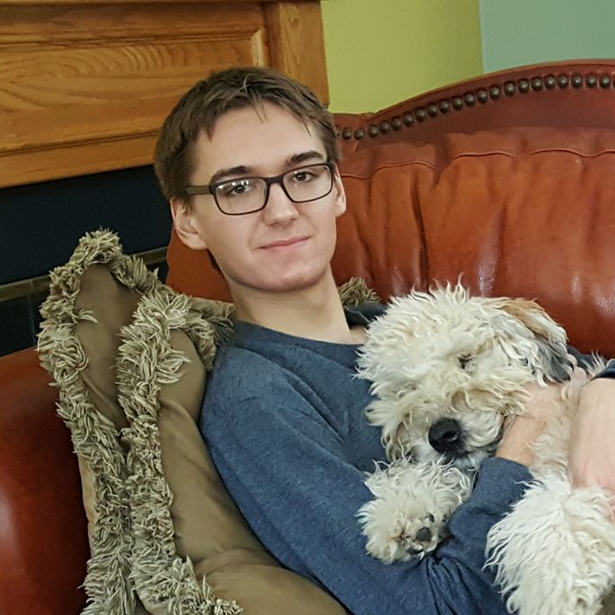

<head>
<!-- Global site tag (gtag.js) - Google Analytics -->

<meta charset="utf-8">
<meta name="viewport" content="width=device-width, initial-scale=1.0">
<meta name="description" content="Kyle Vedder's Homepage">
<meta name="author" content="Kyle Vedder">
<link rel="shortcut icon" href="favicon.ico">
<title>Kyle Vedder's Homepage</title>

</head>

# I'm Kyle Vedder

In 20 years I want there to be robots that can effectively provide a full range of quality care to the elderly. The US is on the verge of a [large retirement of baby boomers](img/static/usa_age_demo.png) and [China faces a deeply troubling demographic cliff in 20 years](img/static/china_age_demo.png), motivating the need for new methods of automated, high quality elder care not reliant upon human labor.

## Research

I am a PhD student at Penn under [Eric Eaton](https://www.seas.upenn.edu/~eeaton/) in the [Lifelong Machine Learning Lab](https://www.grasp.upenn.edu/labs/lifelong-machine-learning). Motivated by my goal of developing elder care robots, my research interests lie in the intersection of:

 - [Mobile robotics](https://www.youtube.com/watch?v=o7WW2cu1h7c)
 - [Vision-based object detection](publications/sparse_point_pillars_snn_workshop.pdf)
 - Self-supervised continual learning

In my undergrad at UMass Amherst I did research under [Joydeep Biswas](https://www.joydeepb.com/) in the [Autonomous Mobile Robotics Lab](https://amrl.cs.umass.edu/). My research was in:

 - [Single-Agent Path Finding (SAPF)](http://vedder.io/publications/ScaffoldsLaneVedderBiswasPlanRob2017.pdf) for sampling based planners
 - [Anytime Multi-Agent Path Finding (MAPF)](http://vedder.io/publications/expanding_astar_aij.pdf) for efficient first solution generation
 - [Core infrastructure](http://vedder.io/publications/MinutebotsRoboCupTDP2017.pdf) and [low level safety system](http://vedder.io/publications/MinutebotsRoboCupTDP2018.pdf) of our [RoboCup Small Size League team](https://amrl.cs.umass.edu/minutebots.html)

## More Information

 - Email: kvedder (at) seas.upenn.edu
 - Resume: [/resume](KyleVedderResume.pdf)
 - Publications: [/publications](publications.html)
 - GitHub: [kylevedder](https://github.com/kylevedder)

## Updates

 - Jun 14th, 2021: [Workshop paper accepted to Sparse Neural Networks: _Sparse PointPillars: Exploiting Sparsity on Birds-Eye-View Object Detection_](publications/sparse_point_pillars_snn_workshop.pdf)
 - Apr 27th, 2021: [My WPEII Presentation: _Current Approaches and Future Directions for Point Cloud Object Detection in Intelligent Agents_](https://www.youtube.com/watch?v=xFFCQVwYeec)
 - Apr 14th, 2021: [My WPEII Document: _Current Approaches and Future Directions for Point Cloud Object Detection in Intelligent Agents_](misc/KyleVedderWPEII2021.pdf)
 - Feb 11th, 2021: [Blog post: Setting up `mujoco-py` for use with on-screen and off-screen rendering](misc/mujoco_py.html)
 - Nov 4th, 2020: [Journal paper accepted to Artificial Intelligence: _X\*: Anytime Multi-Agent Path Finding for Sparse Domains using Window-Based Iterative Repairs_](http://vedder.io/publications/expanding_astar_aij.pdf)
 - Jul 23rd, 2020: [Presentation: _From Shapley Values to Explainable AI_](https://www.youtube.com/watch?v=4RkhsIz14Yc)
 - Jun 29rd, 2020: [Demo: _Penn Service Robots navigating around Levine_](https://www.youtube.com/watch?v=o7WW2cu1h7c)
 - May 8th, 2020: [Term paper: _An Overview of SHAP-based Feature Importance Measures and Their Applications To Classification_](misc/shap_for_classification.pdf)
 

