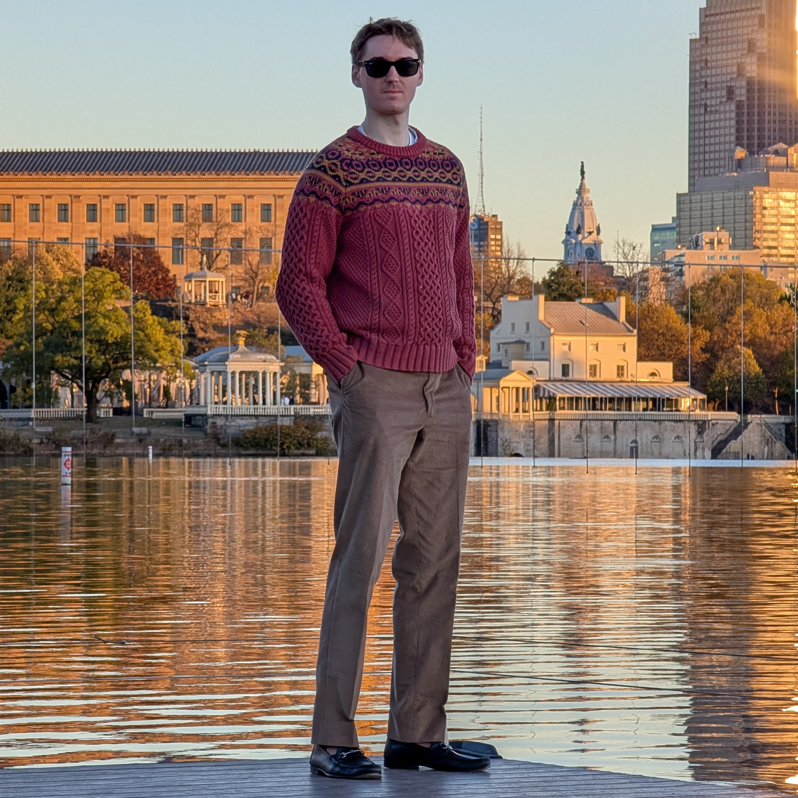

HEADER Kyle Vedder's Homepage

<h1>I'm Kyle Vedder</h1>

I am a researcher at [Physcial Intelligence](https://www.physicalintelligence.company), where I work on building self-improving robotics systems. Before that, I worked at [Dyna Robotics](https://dyna.co/), where I did full stack robot learning, touching every part of the data collection, model training, and inference stack.

I did my CS PhD at Penn, where I was advised by [Eric Eaton](https://www.seas.upenn.edu/~eeaton/) in the [GRASP Lab](https://www.grasp.upenn.edu/). My PhD research focused on scene flow: building better evaluations, and developing a repertoire of tricks to make scalable, flexible scene flow a reality. I was fortunate to work closely with [Deva Ramanan](https://www.cs.cmu.edu/~deva/), [James Hays](https://faculty.cc.gatech.edu/~hays/), and [Dinesh Jayaraman](https://www.seas.upenn.edu/~dineshj/) throughout my PhD. For a short narrative overview of how my PhD research fits together, see [_Overview of my PhD Research_](./overview_of_my_phd.html). For a longer overview with nice pictures, check out the intro of [my thesis](https://arxiv.org/abs/2503.15666).

## More Information

 - Email: kyle (dot) c (dot) vedder (at) gmail.com
 - Resume: [/resume](KyleVedderResume.pdf)
 - Publications: [/publications](publications.html)
 - GitHub: [kylevedder](https://github.com/kylevedder)
 - Google Scholar: [Kyle Vedder](https://scholar.google.com/citations?user=Ml6RzmEAAAAJ&hl=en)
 - Twitter: [KyleVedder](https://twitter.com/KyleVedder)
 - Writings: [/misc](misc.html)
