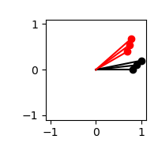

HEADER On Homogeneous Transforms

# On Homogeneous Transforms

I can never remember the difference between left and right multiplying transform matrices, so I'm writing all this down mostly for myself.

## 2D Rotations


Let $v$ be an array of 2D vectors of shape $N \times 2$:

$$
v = \begin{bmatrix}
0.8 & 0 \\
0.9 & 0.1 \\
1 & 0.2 \\
\end{bmatrix}
$$

Let $R$ be a $K$ degrees counterclockwise rotation matrix:

$$
R = \begin{bmatrix}
\cos K & -\sin K \\
\sin K & \cos K
\end{bmatrix}
$$

### Right multiplication

Expressed with a right multiply, the rotated $v'$ would be 

$$v' = (Rv^T)^T$$

Note the shapes: $v$ is $N \times 2$ and $R$ is $2 \times 2$, so we end up with $N \times 2 = ((2 \times 2)(N \times 2)^T)^T$. In numpy for a 30 degree counterclockwise rotation:
```
v = np.array([[0.8, 0], [0.9, 0.1], [1, 0.2]])

def make_rotation_matrix(K_rad):
    return np.array([[np.cos(K_rad), -np.sin(K_rad)],
                     [np.sin(K_rad), np.cos(K_rad)]])

vprime = (make_rotation_matrix(np.deg2rad(30)) @ v.T).T
```

which, visualized as vectors from the origin, produces the expected result:




### Left multiplication

Expressed with a left multiply, the rotated $v'$ would be 

$$v' = vR^T$$

Note the shapes: $v$ is $N \times 2$ and $R$ is $2 \times 2$, so we end up with $N \times 2 = (N \times 2)(2 \times 2)$. In numpy:

```
vprime = v @ make_rotation_matrix(np.deg2rad(30)).T
```

which again visualized as vectors from the origin  produces the same result: 


## 2D Homogeneous Transforms

Imagine instead of a simple rotation by $R$, we also wanted to transform the points that included a translation $t = (-1, -0.5)$. We could represent this as two separate operations, a rotation and a translation, or we could represent it as a single homogeneous transform $M$:

$$
M = \begin{bmatrix}
R & t \\
0 & 1
\end{bmatrix}
$$

where $R$ is the same rotation matrix as before, and $t$ is the column version of the translation vector (i.e. $t^T$). To do this, we augment the $v$ vectors with a third column of ones, i.e.

$$
v_h = \begin{bmatrix}
0.8 & 0 & 1 \\
0.9 & 0.1 & 1 \\
1 & 0.2 & 1 \\
\end{bmatrix}
$$

making it an $N \times 3$ matrix. The homogeneous transform $M$ is a $3 \times 3$ matrix, so we can left multiply it with $v$ to get the transformed $v_h'$:

$$
v_h' = v_hM^T
$$

In numpy

```
def make_transform_matrix(K_rad, translation):
    return np.array([[np.cos(K_rad), -np.sin(K_rad), translation[0]],
                     [np.sin(K_rad), np.cos(K_rad), translation[1]],
                     [0, 0, 1]])

def make_homogeneous(v):
    return np.hstack((v, np.ones((v.shape[0], 1))))

vprime_h = v_h @ make_transform_matrix(rotation, translation).T
```

which, visualized as vectors from the origin, produces the expected result:


