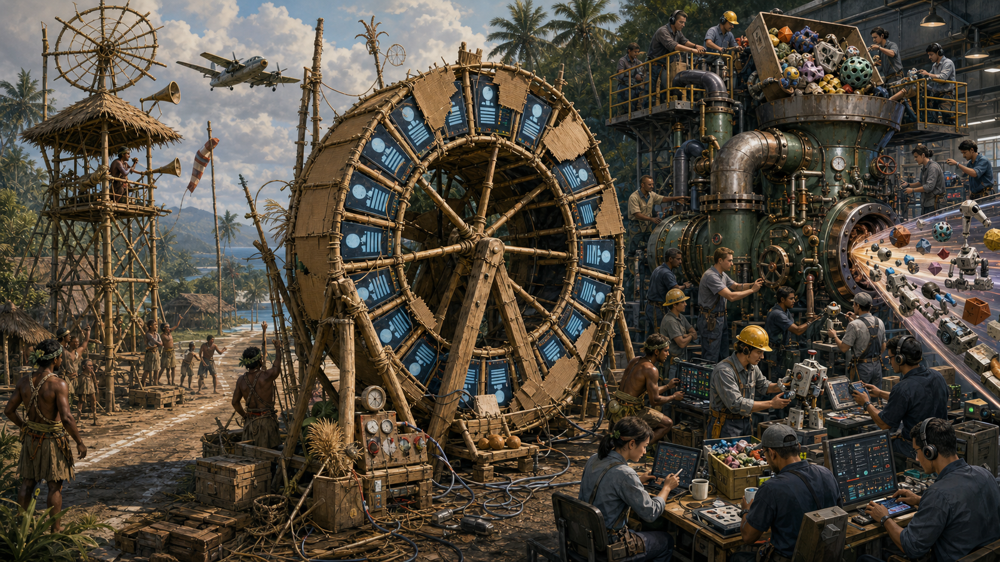
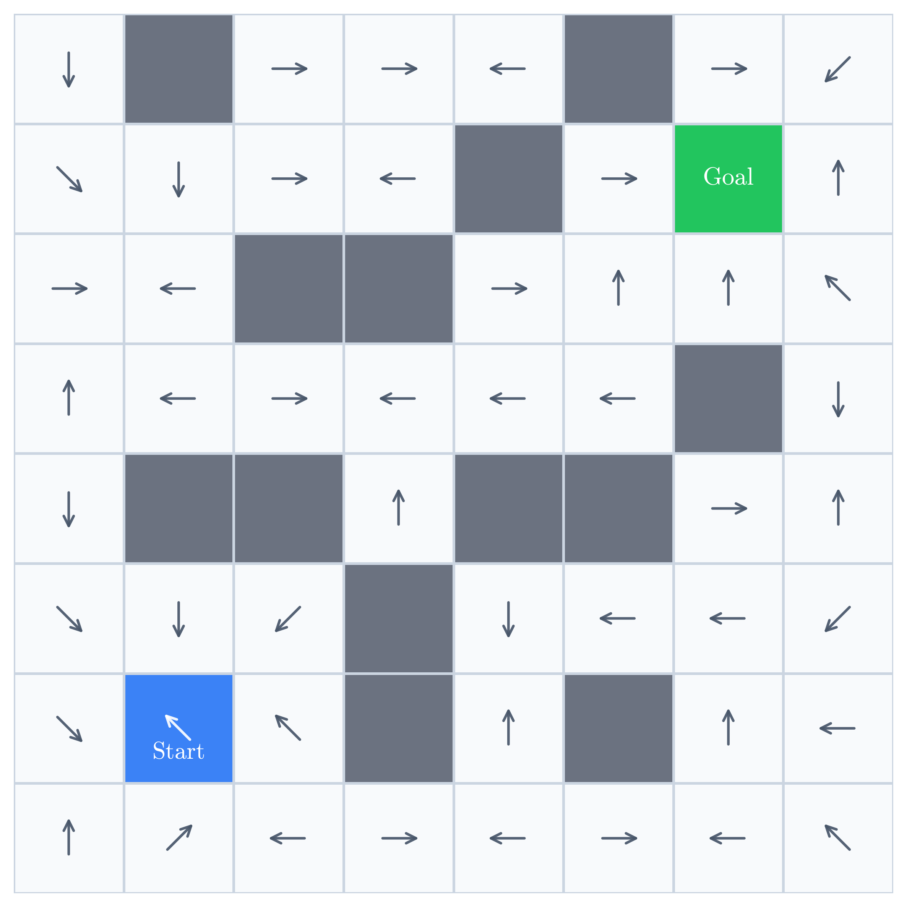
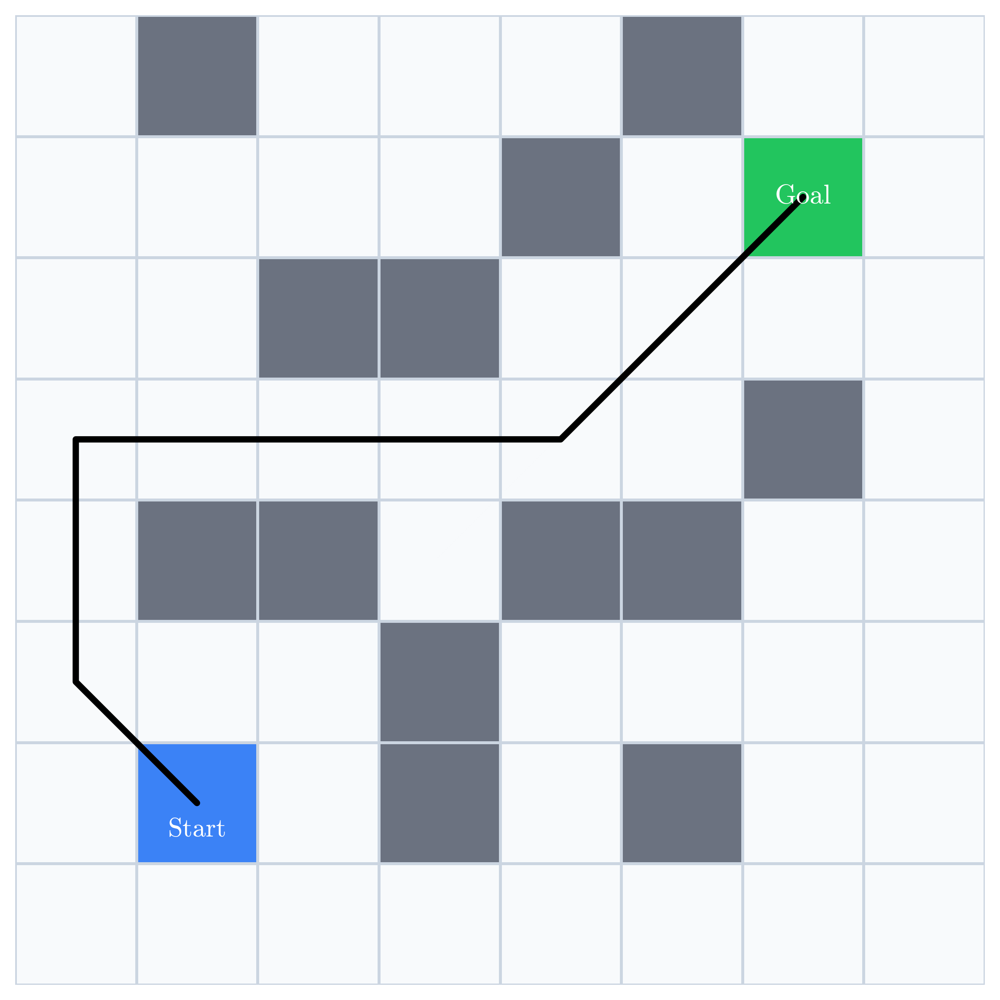
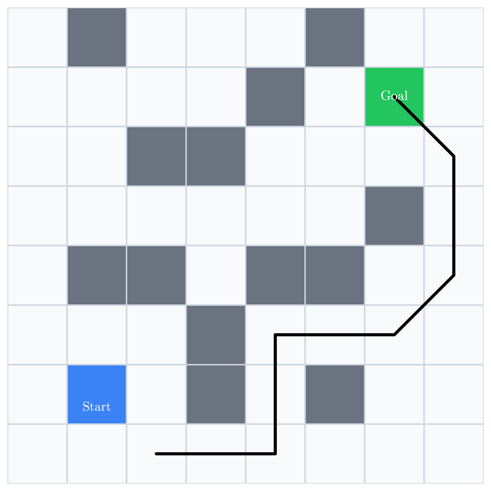
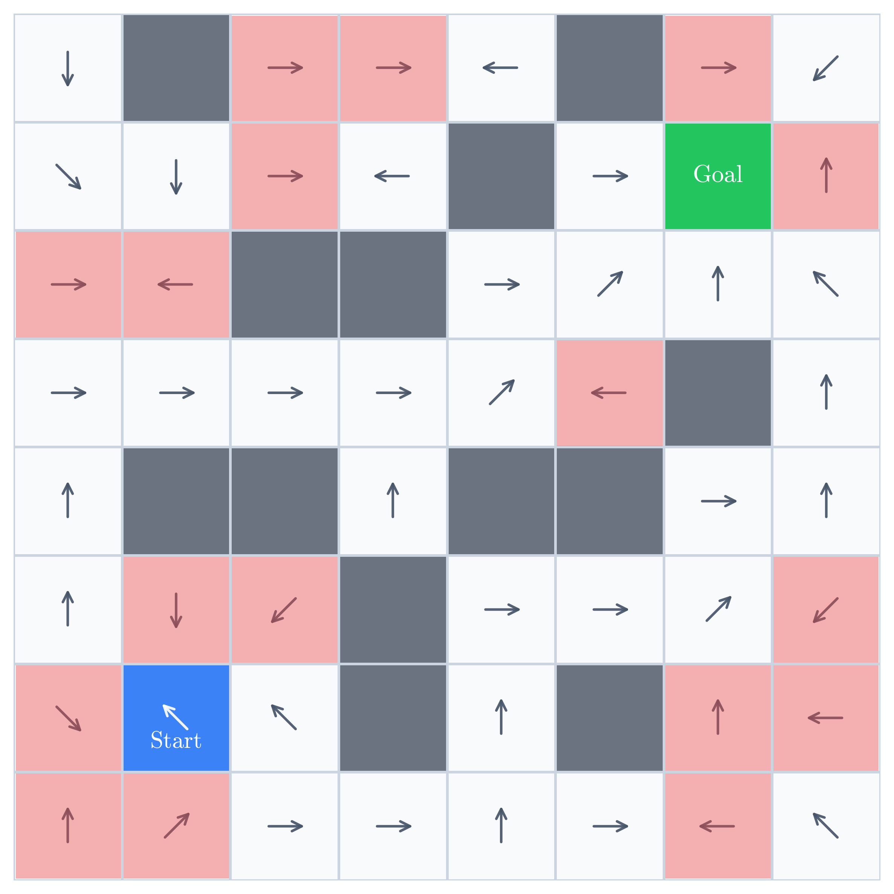
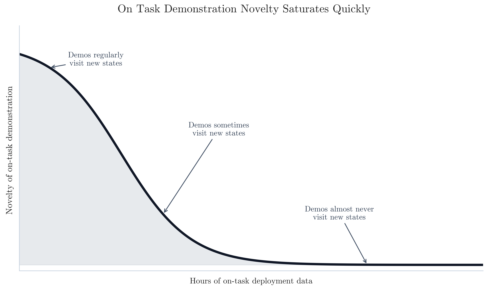

HEADER {"page_name": "The Novelty Pump", "teaser_img": "https://vedder.io/img/static/novelty_pump/novelty_flywheel_teaser.png"}

# Cargo Cults, Data Flywheels, and Novelty Pumps

Every robotics company with plans to deploy robots claims to have a "scalable data flywheel". The pitch goes something like:

> We deploy robots, collect data from those deployments, and use that data to improve the policy. The improved policy unlocks more deployments, which produce even more data. This flywheel compounds, and so too will our lead.

This is the scale-pilled version of post-WWII [Melanesian Cargo Cults](https://en.wikipedia.org/wiki/Cargo_cult) that thought building fake airstrips will make American cargo planes continue to show up and give them goods.

The value of scale is not more data for the sake of more data; it's more data for the sake of capturing more _novelty_. Novelty comes from:

 - demonstrations visiting new states within a task
 - demonstrations for new tasks showcasing new strategies and interaction patterns

You do not get that by deploying more robots doing the same task. You can only get that by operating a Novelty Pump, which requires constant operational effort and does not compound.

## First Principles: What Makes a Demonstration Novel?

Consider a simple gridworld. The robot starts in the blue cell, must reach the green cell, and cannot pass through the gray obstacles. We want to learn a policy $\pi$ that maps each state $s$ to an action $a$.

In robot learning, $\pi$ is usually represented by a neural network with parameters $\theta$, giving us $\pi_\theta$. Before training, the network's actions are effectively arbitrary:

The gridworld

A randomly initialized $\pi_\theta$

Behavior cloning, also called imitation learning, is the workhorse learning paradigm in robotics. An expert demonstrates how to complete the task, and the policy learns to predict the expert's action in each visited state.

Suppose we collect two demonstrations:

Demo 1

Demo 2

These demonstrations supply labels along the paths the expert visited. The network may generalize to nearby states, but the demonstrations give it no direct evidence elsewhere.

The remaining gap becomes visible when we compare the trained policy with the optimal policy:

The optimal policy $\pi^*$

Errors remaining after training on Demo 1 and Demo 2

Training longer on the same two demonstrations may sharpen behavior along those paths, but it supplies no new evidence about the red regions. Fixing them requires demonstrations that visit those states, recover from them, or teach a strategy that generalizes into them.

A demonstration's novelty therefore depends on what the policy already knows. For an untrained policy, any demonstration is novel, but once the policy masters the common cases, another ordinary demonstration contains little new information and its novelty goes to zero.

## The Anatomy of a Novelty Pump

In order to constantly acquire novelty, you have to run a Novelty Pump. To do that means your operations team needs to hustle along two orthogonal axes: within task, and across task.

Within a task, novelty comes from correction data in states the current policy handles poorly. This is the idea behind [DAgger](https://proceedings.mlr.press/v15/ross11a.html): run the policy, observe the states it makes mistakes in, and ask a human expert to teleop corrections from that state. These corrections are valuable to improving the specific policy on that specific task for new deployments of that task, but they treat task-specific and policy-specific aberrations. Relative to the vast scale of pretraining corpora, you need many of these corrections across many tasks if you hope to substantively improve the quality of the overall policy in new task domains.

Across tasks, novelty comes from data that requires diverse behaviors and strategies in diverse environments. A useful dataset includes objects that must be pinched, scooped, pulled, regrasped, etc using one or both arms. These examples teach a larger vocabulary of grasps and coordination patterns that the policy can reuse when it encounters a new task. Scaled-up task, strategy, and domain diversity are the primary driving factors for getting a policy to perform better in new deployments for new tasks.

Doing this is _hard_. It requires your ops team to get up every morning and do something they've never done before. Much like seeking alpha in markets, any pockets of novelty found can be exploited for a while, but it will dissipate and the team will have to move on to seeking it elsewhere.

## Data Flywheels explicitly avoid Novelty

A deployment-driven data flywheel, where autonomy is both supposed to be driving value _and_ generating training data, is by construction devoid of:

 - _most_ within-task diversity --- the model's ability to already perform well is what allows the model to be deployable[^1]
 - _all_ across-task diversity --- demonstrations of task A, which the model can competently perform, do not magically unlock task B that it previously could not perform

### Common Retorts

> Human teleop will let you go beyond the capabilities of the existing model

This is true, _but that's a Novelty Pump grafted on the backend as an afterthought_. You no longer have the scalable flywheel originally promised anymore, and this sleight of hand is, charitably, downstream of lack of clarity of thought and, uncharitably, downstream of intellectual dishonesty.

> Deployment discovers long-tail failures

This is true, but only if the robot reaches them, recognizes them, logs them, and routes them into corrective data. That is an ops loop, not an automatic flywheel.

> On-policy robot data is still useful

This is true, but it also quickly saturates; no learning scheme is able to extract new value from data that contains no novelty.

## Closing Thoughts

### Needing Novelty is not new

The need for novelty is not a new concept -- in early LLMs, it was standard to train on Common Crawl, but its trillions of tokens repeat copied pages, boilerplate, and garbage ad copy. [C4](https://arxiv.org/abs/1910.10683) made Common Crawl more useful for training by filtering the crawl and deduplicating repeated text. C4 strictly removed data, but it made it so a fixed training budget reaches more distinct material and thus the model saw more _novelty_. Today, frontier labs pay top dollar for work products like Discounted Cash Flow models or undigitized books from low resource languages because these datasets contain _novelty_ that can improve model capabilities. They are not paying for The Great Gatsby copy and pasted 1000 times to approximate the same number of tokens.

### Cherish your high performing ops team

As I pointed out above, building a Novelty Pump is extremely hard work, which is why "scalable data flywheel" is so much more alluring. The Novelty Pump requires hiring and building out a talented operations team that possesses an intuitive understanding of data's impact on the model.

Within-task policy correction requires attention to detail and a tight feedback loop between the operator who's collecting the data and the researcher training the policy and watching the evals. Some organizations try to merge these roles into a single person, but the attention to detail required makes this role _highly_ human capital constrained, and power laws dominate in terms of efficacy.

Similarly, effective across-task novelty creation requires an operations team that can maintain global context on what kind of tasks and strategies have been showcased in past demonstrations to ensure they are constantly pumping novelty into the collected data. This constant search for novelty runs counter to almost every operations playbook, which tries to standardize everything and minimize the amount of global context needed when making decisions.

As a consequence, I think a strong operations team is _criminally_ underrated in robot learning, and as orgs wake up to this, high quality seasoned operations heads are going to start fetching compensation packages on par with top researchers, because they will have the experience and know-how to effectively build and scale the Novelty Pump to actually meaningfully move the needle on model performance.

[^1]: As discussed in $\pi_{0.6}^*$, there is some value in training on your own rollouts to provide data for advantage conditioning.
