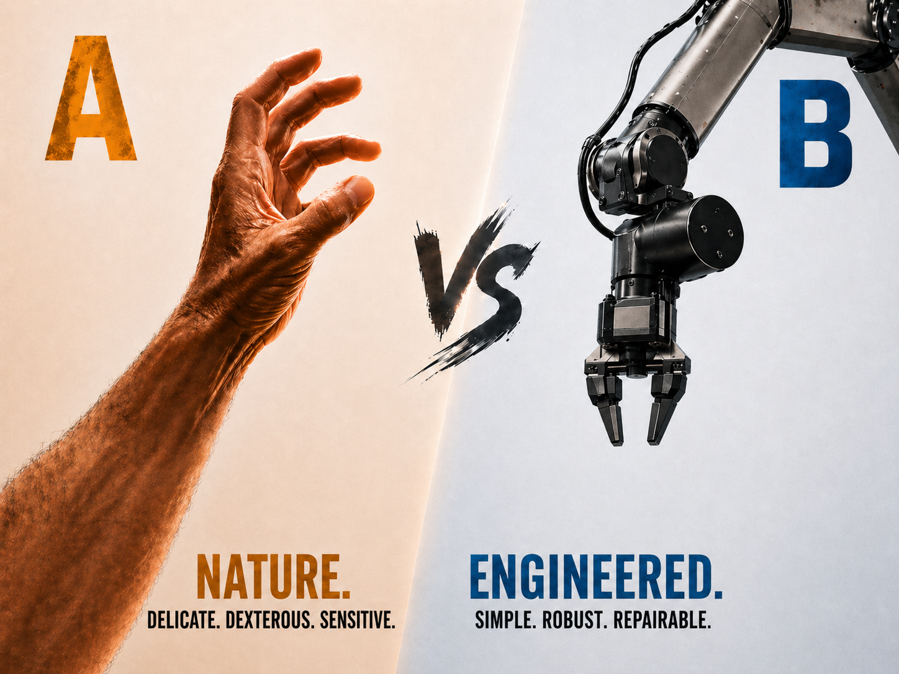
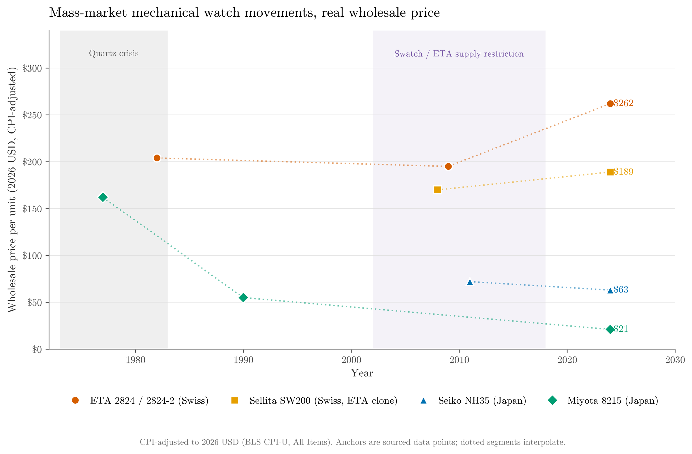
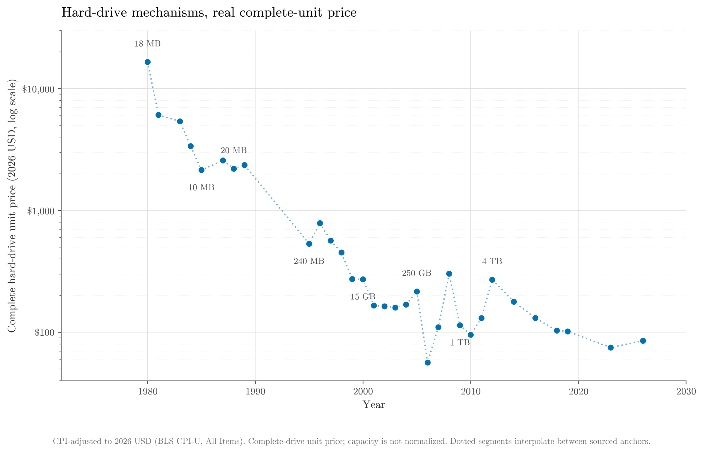

HEADER {"page_name": "The Case Against Human Hands", "teaser_img": "https://vedder.io/img/static/the_argument_against_human_hands/hands_teaser.png"}

# The Case Against Human Hands

Copying biological morphology imports biological constraints --- small fingers, dense cabling, delicate joints --- without preserving the biological advantages that justified them: free self-healing, free compliance, a metabolic budget that penalizes large limbs. Robots should buy dexterity along their substrate's cheap dimensions instead: more arms, simpler contact geometry, and bigger serviceable actuators.

## The Argument

A lot of today's robot designs are transparently attempts to copy what biology built --- humanoid form factors; head-based vision; delicate, touch-sensitive hands. This is not driven by first principles thinking; we are building atop a mechanical substrate, not a biological one, and with that we need to consider the completely different set of strengths and weaknesses in our designs.

Biological systems are able to self-heal, but they need rest, consume food, and their morphologies are optimized in the face of very strict metabolic constraints. Mechanical systems avoid many of these pitfalls and operate under far less stringent power constraints, but they do not self-heal; wear lifecycles and maintenance are as serious a design consideration as the morphology itself.

These substrate differences become highly pronounced when selecting an end effector. In humans, we have two delicate, highly dexterous and touch-sensitive hands on the end of two arms. These are the result of significant biological optimization pressures. Additional arms would carry metabolic, developmental, neural, and anatomical costs; napkin math suggests that at 5% of body mass per arm, this would add 5% to 10% additional TDEE. We use touch, because wrist cameras don't make metabolic or mechanical sense --- they need a long, mechanically exposed, high-bandwidth optic nerve running the length of each arm, connected to enormous amounts of additional supporting neural tissue that alone would add 1% to 10% additional TDEE.

In the mechanical world, we have very different considerations. Metabolic requirements are not strict, but reliability and maintenance needs are. Thus, the substrate-correct thing to do is manage complexity and wear by moving it out of small, delicate, high-contact assemblies and into places that are significantly cheaper to build and maintain. Larger components like arm joint motors are easy to replace and repair, and so they should house mechanical complexity; end effector sensing stacks should use contact-free methods like wrist cameras to reduce wear, and wear parts should themselves be cheap and easy to replace (e.g. 3D printed gripper tips).

This principled thinking clearly motivates parallel jaw grippers. Bimanual parallel jaw grippers are sufficient to perform most tasks. For tools designed for human hands, parallel jaws can [power-grasp them by wrapping their spring-loaded jaws around the handle](https://www.pi.website/blog/pi07) (e.g. holding a knife to chop a cucumber) without any of the precision-grip machinery that justifies five fingers. For fine-grained manipulation that intuition suggests requires fingers, [the results in RL Token](https://www.pi.website/research/rlt) show learned policies push parallel jaws substantially further than the conventional intuition allows (e.g. by installing small screws or closing zip-ties). For the residual class of tasks they truly cannot do (e.g. tying a bow), it makes sense to add a third or fourth arm rather than additional end effector complexity.

## Economies of scale cannot save you

Proponents of dexterous hands will handwave about economies of scale driving down costs --- the logic goes "yes they're complex, but if we ship hundreds of millions of units, prices will be so cheap it doesn't matter".

But does this logic hold for relatively small mechanical devices with lots of moving parts? It seems the answer is no. I selected two imperfect surrogate products:

 - **Mechanical watch movements** --- finger-sized, ~100-part, micron-tolerance assemblies.
 - **Hard disk drives** --- mid-sized electromechanical assemblies produced at enormous volumes.

Unlike smartphones --- a favorite but inappropriate comparison --- these devices have many mechanical moving parts but are sealed and free of active contact wear. That makes them merely surrogates, an optimistic benchmark for the cost savings multiples we can expect out of complex mechanical hands.

Both devices show the same shape: real unit prices fall **~87%** (watches) and **~99%** (HDDs) from launch to the modern floor, with most of the decline in the first decade or two, after which the floor is set by physics and prices track industry structure.

#### Pricing Mechanical Watch Movements

A Miyota 8215 --- ~100-part, micron-tolerance, fully mechanical --- wholesales for **$15 -- 25** in packs of 300, produced at >1M units/year. In real terms it fell from **~$162 (2026 dollars) at launch in 1977 to ~$21 today**, an 87% decline, most of it taken by the late 1980s. The Seiko NH35 runs $40 -- 80 and is roughly flat in real terms. The Swiss ETA 2824-2 went the *other* way, climbing ~30% to $200 -- 300 as Swatch restricted supply through the 2010s. The floor was hit a generation ago; price now responds to industry structure, not process improvement. [Dataset.](../img/static/the_argument_against_human_hands/mech_movement_prices.md)

#### Pricing HDDs

A complete HDD fell from **~$16,500 (2026 dollars) in 1980 to $70 -- 100 today**, a ~99% decline. As with watches, most of it came early: the cheap-drive floor was already in the low hundreds by the early 2000s and has lived in the $50 -- 200 real band for two decades. The famous price-per-byte collapse came from packing more data into the same mechanism --- the *mechanism* itself did not get seven orders cheaper. [Dataset.](../img/static/the_argument_against_human_hands/hdd_prices.md)

#### Pricing mechanical hands

The low-cost commercial five-finger hand floor is around **$5,000 -- 7,500**: an Inspire RH56F1 is **$5,062.50**, a tactile RH56F1 variant is **$6,294**, and an RH56E2 is **$7,500**. A Schunk SVH is **~$54,000**. A Shadow Dexterous Hand is **>$60,000**. The hand floor sits two orders of magnitude above the small-precision-mechanism floor, the ceiling three --- and that proxy floor is for *sealed* devices that never see contact wear.

#### Pricing actuators

Big actuators are comparatively cheap. Teknic ClearPath integrated servos start at **$249** because their electronics benefit from semiconductor scaling, and the remaining mechanical components are larger, accessible, and replaceable; they fail in diagnosable, repairable ways. Bare NEMA 23 BLDCs are $100 -- 200; planetary gearboxes at quantity 100+ run $88; harmonic drives start at $119. A complete arm joint at scale lands in the low hundreds; full 6-DoF arms are already retailing in the low thousands. The [I2RT YAM](https://i2rt.com/products/yam-6-dof-arm) is **$2,999** with gripper included, 2 kg nominal payload, 750 mm reach, and 4.68 kg arm weight. AgileX lists the [PiPER](https://global.agilex.ai/products/piper) and [PiPER-X](https://global.agilex.ai/products/piper-x) at **$1,999**.

Stack the two configurations on the same robot:

 - *Two arms, two hands.* Using YAM/PiPER-class arms, **~$4 -- 6k** of arm plus **$10k -- $120k** of hands. **$14 -- 126k**, dominated by the hands. Many small actuators, joints, sensors, and cables routed through the wrists; failure modes everywhere.
 - *Three arms, three parallel jaws.* Three YAM/PiPER-class arms with simple grippers are **~$6 -- 9k** retail.

A third arm with a parallel jaw costs less than putting fingers on either of the first two. The ratio is set by the gap between watch-class parts and motor-class parts, and the watch-class side is not catching up.

## "Free" transfer from human demo data isn't free

Some hand proponents accept all of the above arguments, but argue that hands unlock data scale that makes them worth it anyway. Ostensibly, if you record POV video and just do simple hand tracking, natural human demos should be transferable to robotic embodiments with "the same" morphology for free. 

Unfortunately, they don't. A human video gives you task intent, object state changes, and rough contact sequencing --- not joint targets, contact forces, friction cones, compliance, or tactile feedback. Those are exactly the parts where the two substrates diverge. Human fingertips are soft, high-friction, self-healing, sensor-rich pads, and humans exploit fingernails and skin deformation as part of manipulation strategies.

A rich body of literature exists on retargeting precisely because handling these gaps is so hard. [Antotsiou et al.](https://openaccess.thecvf.com/content_ECCVW_2018/papers/11134/Antotsiou_Task-Oriented_Hand_Motion_Retargeting_for_Dexterous_Manipulation_Imitation_ECCVW_2018_paper.pdf) chain pose estimation, IK, particle-swarm optimization, and a task objective just to drive a 29-DoF hand. [DLR](https://elib.dlr.de/147181/1/document_copyright.pdf) needs filtering and point-pattern matching for usable joint targets. [DexPilot](https://arxiv.org/abs/1910.03135), the canonical success, is a custom vision teleop system --- not free transfer from video. Newer work makes the embodiment gap explicit: [DexUMI](https://arxiv.org/abs/2505.21864) bridges kinematics with a wearable exoskeleton and vision with robot-hand inpainting; [ADAPT-Teleop](https://www.nature.com/articles/s44182-025-00034-3) builds human-matched kinematics on purpose and still has to engineer around skin friction, viewpoint, and compliance.

## Conclusion

Human hands are a local optimum for biology, not a target for robots. When building a system, it's critical to check the assumptions you're making, explicit and implicit, against the laws of physics and your actual goals. When run honestly, the math for robot hands just doesn't make sense --- the answer that pops out is simple end effectors mounted on more arms with bigger, serviceable actuators.
