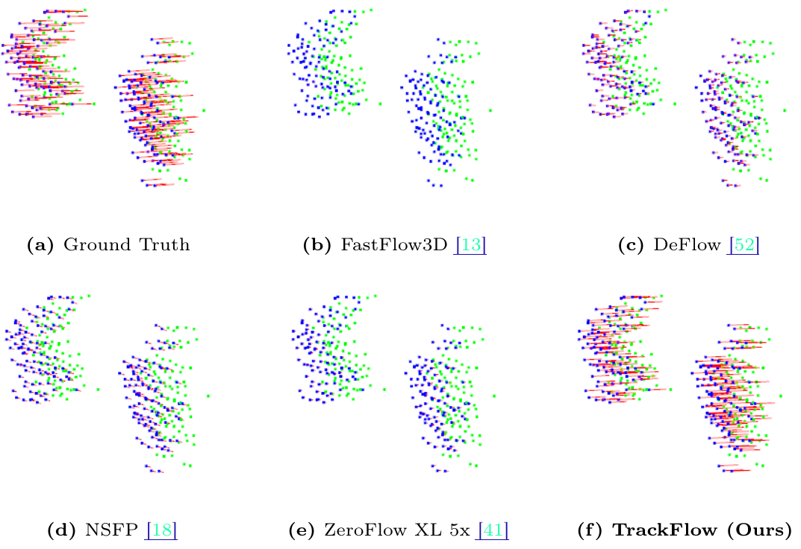
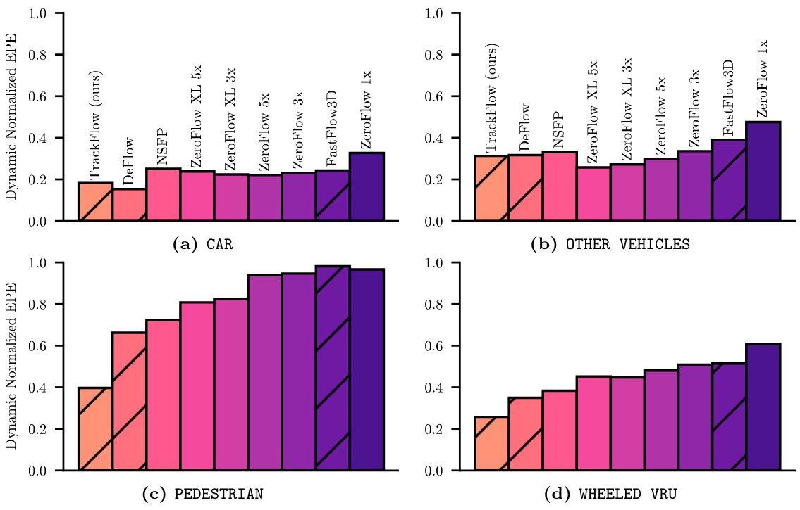

HEADER {"page_name": "I Can't Believe It's Not Scene Flow!", "teaser_img": "http://vedder.io/img/static/trackflow/teaser.png"}
<!-- <style>
* {
  background-color: #f5bd3a;
}
</style> -->

<!-- Color is f5bd3a -->

# _I Can't Believe It's Not Scene Flow!_

## [Ishan Khatri](https://ishan.khatri.io/)\*, [Kyle Vedder](http://vedder.io)\*, [Neehar Peri](http://www.neeharperi.com/), [Deva Ramanan](https://www.cs.cmu.edu/~deva/), and [James Hays](https://faculty.cc.gatech.edu/~hays/)

<!--  -->

\* Equal contributions

<!-- ## Abstract

Current scene flow methods broadly fail to describe motion on small objects, and current scene flow evaluation protocols hide this failure by averaging over many points, with most drawn from larger objects. To fix this evaluation failure, we propose a new evaluation protocol, _Bucket Normalized EPE_, which is class-aware and speed-normalized, enabling contextualized error comparisons between object types that move at vastly different speeds. To highlight current method failures, we propose a frustratingly simple supervised scene flow baseline, _TrackFlow_, built by bolting a high-quality pretrained detector (trained using many class rebalancing techniques) onto a simple tracker, that produces state-of-the-art performance on current standard evaluations and large improvements over prior art on our new evaluation. Our results make it clear that all scene flow evaluations must be class and speed aware, and supervised scene flow methods must address point class imbalances. We release the evaluation code publicly at [https://github.com/kylevedder/BucketedSceneFlowEval](https://github.com/kylevedder/BucketedSceneFlowEval). -->

<div class="centered">
# [[Paper]](https://arxiv.org/abs/2403.04739) [[Eval Code]](https://github.com/kylevedder/BucketedSceneFlowEval)
</div>

## Problem 1: Current scene flow methods fail on small objects


We visualize a cherry picked example of two moving pedestrians (walking from left to right) with unusually high density lidar returns. We expect state-of-the-art scene flow methods would work well on this easy instance, but find that they fall short. Notably, our method _TrackFlow_ is the only method to estimate proper flow for these pedestrians.

## Problem 2: Standard eval metrics don't capture this failure

Current eval metrics (Average EPE, Threeway EPE) are reporting average error on the order of centimeters for state-of-the-art methods; new papers push these errors down by small fractions of a centimeters. These metrics are _not_ informative --- due to point imbalances, minor improvements on car motion estimation improves the metric by a significant amount, while major failures on small objects are treated as a rounding error.


## Fix 1: Measuring this failure with _Bucket Normalized EPE_

We propose a new evaluation protocol, _Bucket Normalized EPE_, that is _class-aware_ and _speed-normalized_. Class-awareness allows us to break down the object distribution into meaningful subsets, and speed normalization allows us to measure _percentage of motion described_ rather than _metric space error_, enabling meaningful comparisons between cars moving at high speeds and pedestrians moving at walking speeds.

_Bucket Normalized EPE_ allows us to quantify the systematic failures of current scene flow methods on small objects.


A collection of state-of-the-art supervised and unsupervised scene flow estimation methods on Argoverse 2’s _test_ split. Supervised methods shown with hatching. **Lower is better.** Notably, existing methods, supervised or unsupervised, fail to describe more than 50% of pedestrian motion (have `>0.5` Dynamic Normalized EPE), highlighting the enormity of the failure of current methods.

## Fix 2: Highlighting the low-hanging fruit with _TrackFlow_

We propose a simple supervised scene flow baseline, _TrackFlow_, built by bolting a high-quality pretrained detector (trained using many class rebalancing techniques) onto a simple tracker. Despite this awkward formulation, _TrackFlow_ not only produces state-of-the-art performance on current standard evaluations, it provides _enormous improvements_ over prior art on our new evaluation (e.g. describing almost 60% of pedestrian motion). _TrackFlow_ is as much a call to action as it is a method: such a simple, cobbled together baseline thoroughly beating other (supervised!) methods means the scene flow community needs to go back to basics.

## Takeway: A call to the community

Scene flow as a problem is not an end unto itself; it is only useful as a primitive for downstream tasks. Those tasks care about error across _all_ moving objects, and method evaluations that actively hide failures on small objects are not just, not useful, they are _actively deceptive_, wasting practitioners time as they try to sort through published methods to find something that _actually_ works.

We provide a very easy-to-use, multi-dataset dataloader and scene flow evaluation toolkit for [_Bucket Normalized EPE_](https://github.com/kylevedder/BucketedSceneFlowEval), and we have integrated it into our [Scene Flow Zoo](https://github.com/kylevedder/SceneFlowZoo) as the standard method for evaluation. While we have provided these tools, the community must use them if we are to make real progress on scene flow. And don't be fooled, there's plenty left to do.


<!-- ## Argoverse 2 2024 Scene Flow Challenge @ CVPR 2024 Workshop on Autonomous Driving

We hosted the [Argoverse 2 2024 Scene Flow Challenge](https://www.argoverse.org/sceneflow), ranking methods by their Dynamic Normalized EPE component of _Bucket Normalized EPE_. -->

<!-- 
## Downloads

[[Paper PDF]](https://arxiv.org/abs/2403.04739)

[[Official Code]](https://github.com/kylevedder/BucketedSceneFlowEval) -->


## Citation

```
BIB bibs/conferences.bib khatri2024trackflow
```