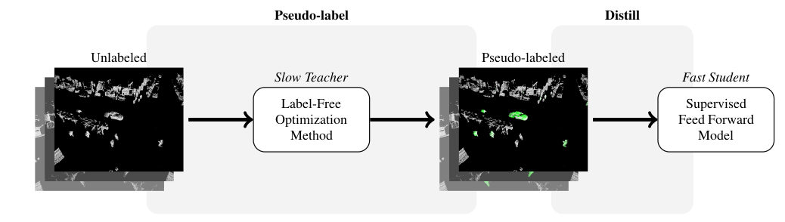
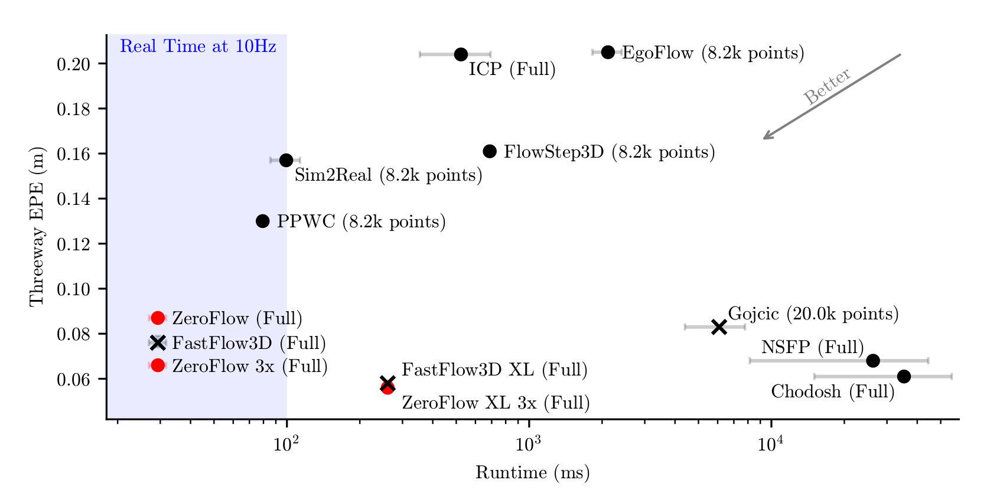

HEADER ZeroFlow: Fast Zero Label Scene Flow via Distillation

# ZeroFlow: Fast Zero Label Scene Flow via Distillation

## [Kyle Vedder](http://vedder.io), [Neehar Peri](http://www.neeharperi.com/), [Nathaniel Chodosh](https://scholar.google.com/citations?user=b4qKr7gAAAAJ&hl=en), [Ishan Khatri](https://ishan.khatri.io/), [Eric Eaton](https://www.seas.upenn.edu/~eeaton/), [Dinesh Jayaraman](https://www.seas.upenn.edu/~dineshj/), [Yang Liu](https://youngleox.github.io/), [Deva Ramanan](https://www.cs.cmu.edu/~deva/), and [James Hays](https://faculty.cc.gatech.edu/~hays/)

## Abstract:

Scene flow estimation is the task of describing the 3D motion field between temporally successive point clouds. State-of-the-art methods use strong priors and test-time optimization techniques, but require on the order of tens of seconds for large-scale point clouds, making them unusable as computer vision primitives for real-time applications such as open world object detection. Feed forward methods are considerably faster, running on the order of tens to hundreds of milliseconds for large-scale point clouds, but require expensive human supervision. To address both limitations, we propose Scene Flow via Distillation, a simple distillation framework that uses a label-free optimization method to produce pseudo-labels to supervise a feed forward model. Our instantiation of this framework, ZeroFlow, produces scene flow estimates in real-time on large-scale point clouds at quality competitive with state-of-the-art methods while using zero human labels. Notably, at test-time ZeroFlow is over 1000x faster than label-free state-of-the-art optimization-based methods on large-scale point clouds and over 1000x cheaper to train on unlabeled data compared to the cost of human annotation of that data. To facilitate research reuse, we release our code, trained model weights, and high quality pseudo-labels for the Argoverse 2 and Waymo Open datasets.

## Key Insights:

Existing scene flow estimation methods are either slow but label free test-time optimization methods, or fast but human supervised feed forward networks. We construct the _Scene Flow via Distillation_ framework to break this tradeoff:



We instantiate this framework in _ZeroFlow_, a scene flow method that scales to real world point clouds. ZeroFlow uses Neural Scene Flow Prior, a high quality label-free optimization method, to generate pseudolabels to train FastFlow3D, a fast, scalable feed forward scene flow network. The resulting method is real-time and produces competitive quality flows with _zero_ human labels.




## Full Paper and Downloads: 

[[Preprint PDF]](https://arxiv.org/abs/2305.10424)

[[Official Code]](https://github.com/kylevedder/zeroflow)

[Model Weights]: Forthcoming

[Videos]: Forthcoming

### Citation:

```
@article{Vedder2023zeroflow,
    author    = {Kyle Vedder and Neehar Peri and Nathaniel Chodosh and Ishan Khatri and Eric Eaton and Dinesh Jayaraman and Yang Liu Deva Ramanan and James Hays},
    title     = {{ZeroFlow: Fast Zero Label Scene Flow via Distillation}},
    journal   = {arXiv},
    year      = {2023},
}
```

